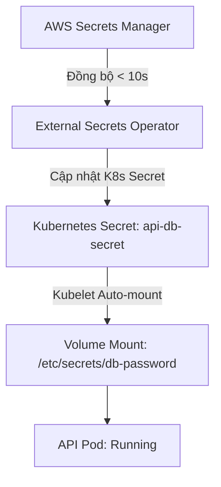

# LAB 2.1: Rotate Secret Không Restart Pod (External Secrets Operator - ESO)

Tài liệu này hướng dẫn cách cấu hình và tích hợp **External Secrets Operator (ESO)** với **AWS Secrets Manager** để tự động đồng bộ Secret vào Kubernetes mà **không cần restart Pod** khi Secret thay đổi giá trị.

---

## 1. Cơ Chế Hoạt Động (Architecture)

Thông thường, nếu inject Secret vào Pod dưới dạng **biến môi trường (env)**, khi giá trị Secret thay đổi, Pod **bắt buộc phải được restart** (ví dụ: dùng reloader, rollout restart) để nhận giá trị mới.

Để cập nhật Secret **không cần restart Pod**, chúng ta sử dụng cơ chế **Mount Volume**:
1. ESO định kỳ kiểm tra (mỗi `10 giây`) và cập nhật giá trị mới từ AWS Secrets Manager vào Kubernetes Secret (`api-db-secret`).
2. Kubernetes kubelet định kỳ đồng bộ hóa sự thay đổi của Kubernetes Secret vào thư mục mount trong Pod (`/etc/secrets/db-password`).
3. Ứng dụng đọc trực tiếp file `/etc/secrets/db-password` mỗi khi xử lý yêu cầu mà không lưu cache cứng vào bộ nhớ, nhờ đó nhận giá trị mới ngay lập tức mà Pod không hề bị khởi động lại (Restart Count = 0).



---

## 2. Cấu Trúc Thư Mục

Các file cấu hình được phân lớp thông qua GitOps (ArgoCD Sync Waves):

```text
eso/
├── secret-store.yaml      # Khai báo SecretStore liên kết tới AWS Secrets Manager (Wave 4)
└── external-secret.yaml   # Khai báo ExternalSecret ánh xạ AWS SM key -> K8s Secret (Wave 5)
argocd/apps/
├── eso.yaml               # ArgoCD App cài đặt Operator từ Helm Chart (Wave -1)
└── eso-config.yaml        # ArgoCD App đồng bộ cấu hình trong folder eso/ (Wave 4)
```

---

## 3. Các Bước Thực Hiện & Kiểm Thử

### Bước 3.1: Tạo AWS Credentials Secret (KHÔNG COMMIT VÀO GIT)
Chạy lệnh PowerShell sau để lấy thông tin tài khoản AWS hiện tại của bạn và tạo Secret bảo mật trong namespace `demo` (đã chạy thành công):
```powershell
$access_key = aws configure get aws_access_key_id
$secret_key = aws configure get aws_secret_access_key
kubectl create secret generic awssm-secret -n demo --from-literal=access-key=$access_key --from-literal=secret-access-key=$secret_key --dry-run=client -o yaml | kubectl apply -f -
```

### Bước 3.2: Kiểm tra trạng thái đồng bộ trong ArgoCD
Sau khi các file cấu hình được đẩy lên Git, hãy đợi ArgoCD đồng bộ:
```powershell
# Xem danh sách ứng dụng ArgoCD
kubectl get application -n argocd
```
Kỳ vọng cả `external-secrets-operator` và `external-secrets-config` đều ở trạng thái `Synced` và `Healthy`.

### Bước 3.3: Kiểm tra Secret được tạo tự động bởi ESO
```powershell
# Kiểm tra xem Secret api-db-secret đã được tạo chưa
kubectl get secret api-db-secret -n demo

# Kiểm tra giá trị hiện tại (đã giải mã base64)
[System.Text.Encoding]::UTF8.GetString([System.Convert]::FromBase64String((kubectl get secret api-db-secret -n demo -o jsonpath='{.data.db-password}')))
```

### Bước 3.4: Đọc Secret từ bên trong Pod đang chạy
```powershell
# Lấy tên Pod API đang chạy
$POD_NAME = (kubectl get pods -n demo -l app=api -o jsonpath='{.items[0].metadata.name}')

# Xem nội dung file secret mount trong Pod
kubectl exec $POD_NAME -n demo -- cat /etc/secrets/db-password
```

### Bước 3.5: Xoay vòng Secret (Rotate Secret) trên AWS
Cập nhật giá trị Secret trên AWS Secrets Manager:
```powershell
aws secretsmanager put-secret-value --secret-id db-password --secret-string "newsupersecretpassword999" --region ap-southeast-1
```

### Bước 3.6: Kiểm chứng xoay vòng không cần restart Pod
Đợi từ 10 - 20 giây và kiểm tra lại:
```powershell
# 1. Đọc lại file secret bên trong Pod để xác nhận giá trị đã cập nhật thành "newsupersecretpassword999"
kubectl exec $POD_NAME -n demo -- cat /etc/secrets/db-password

# 2. Xác nhận Pod KHÔNG bị restart (Restart Count vẫn bằng 0 và Pod Name/Age giữ nguyên)
kubectl get pods -n demo -l app=api
```
