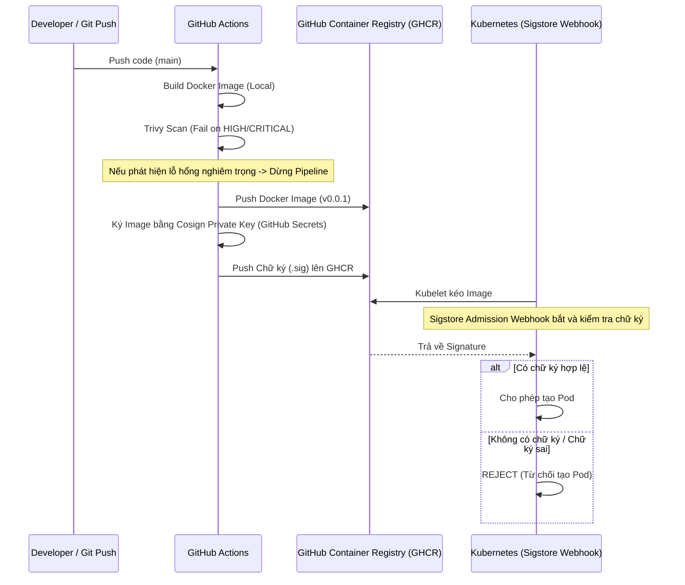

# LAB 2.2: Quy trình Scan, Ký (Sign) và Xác thực (Verify) Container Image

Tài liệu này hướng dẫn chi tiết cách cấu hình quy trình bảo mật chuỗi cung ứng phần mềm (Software Supply Chain Security) cho ứng dụng bằng cách kết hợp **Trivy** (quét lỗ hổng), **Cosign** (ký số image), và **Sigstore Policy Controller** (kiểm soát việc khởi chạy trong cluster).

---

## 1. Cơ Chế Hoạt Động (Workflow)



---

## 2. Các Thành Phần Triển Khai

1. **GitHub Actions Workflow** (`.github/workflows/build-push.yml`):
   - **Trivy Scan Step**: Quét ảnh Docker cục bộ trước khi push. Ngăn chặn việc release nếu phát hiện lỗ hổng `HIGH` hoặc `CRITICAL`.
   - **Cosign Sign Step**: Cài đặt Cosign CLI và ký số tất cả các tag được sinh ra bằng khóa bí mật lấy từ GitHub Secrets (`COSIGN_PRIVATE_KEY` và `COSIGN_PASSWORD`).
2. **Sigstore Policy Controller** (`argocd/apps/policy-controller.yaml`):
   - Cài đặt Policy Controller của Sigstore vào namespace `cosign-system` dưới dạng Admission Webhook.
3. **ClusterImagePolicy** (`policies/cluster-image-policy.yaml`):
   - Khai báo chính sách kiểm tra trên toàn bộ cluster đối với các ảnh bắt đầu bằng `ghcr.io/vanphutin/w10-api*`.
   - Sử dụng khóa công khai khóa cứng (`signing/cosign.pub`) để xác thực chữ ký.

---

## 3. Các Bước Nghiệm Thu & Minh Chứng (Proof of Execution)

### Bước 3.1: Kiểm tra việc Ký ảnh thành công bằng Cosign
Sử dụng khóa công khai `cosign.pub` để xác minh chữ ký của ảnh `v0.0.1` đã được đẩy lên GHCR:
```bash
docker run --rm -v "${PWD}/signing:/keys" ghcr.io/sigstore/cosign/cosign:v2.2.3 verify --key /keys/cosign.pub ghcr.io/vanphutin/w10-api:v0.0.1
```
**Kết quả (Kỳ vọng/Thực tế):**
```json
Verification for ghcr.io/vanphutin/w10-api:v0.0.1 --
The following checks were performed on each of these signatures:
  - The cosign claims were validated
  - Existence of the claims in the transparency log was verified offline
  - The signatures were verified against the specified public key
[{"critical":{"identity":{"docker-reference":"ghcr.io/vanphutin/w10-api"},"image":{"docker-manifest-digest":"sha256:366d0c60136076d2c7b8937e62cd2942e0f66b250055bb091352d920cfe3f0a5"},"type":"cosign container image signature"}...}]
```
👉 **Trạng thái: ĐẠT** (Ảnh đã được ký thành công).

---

### Bước 3.2: Kích hoạt chính sách xác thực trên Namespace
Chỉ kích hoạt kiểm tra chữ ký trên các namespace được gắn nhãn (để tránh làm ảnh hưởng đến các ứng dụng hệ thống khác):
```bash
kubectl label namespace demo policy.sigstore.dev/include=true --overwrite
```

---

### Bước 3.3: Thử nghiệm deploy ảnh CHƯA ĐƯỢC KÝ (Unsigned Image)
Cố gắng khởi chạy một Pod sử dụng tag ảnh chưa qua quy trình ký số (`unsigned-test`):
```bash
kubectl apply -f unsigned-test-pod.yaml
```
**Kết quả thực tế từ Cluster:**
```text
Error from server (BadRequest): error when creating "unsigned-test-pod.yaml": 
admission webhook "policy.sigstore.dev" denied the request: 
validation failed: invalid value: ghcr.io/vanphutin/w10-api:unsigned-test must be an image digest
```
👉 **Trạng thái: ĐẠT** (Admission Webhook đã bắt chặn và từ chối khởi tạo Pod do không có chữ ký số hợp lệ).

---

### Bước 3.4: Thử nghiệm deploy ảnh ĐÃ ĐƯỢC KÝ (Signed Image)
Khởi chạy một Pod sử dụng phiên bản đã qua ký số hợp lệ (`v0.0.1`):
```bash
kubectl apply -f signed-test-pod.yaml
```
**Kết quả thực tế từ Cluster:**
```text
pod/signed-test-pod created
```
👉 **Trạng thái: ĐẠT** (Pod chạy thành công do chữ ký số khớp hoàn toàn với khóa công khai trong `ClusterImagePolicy`).
