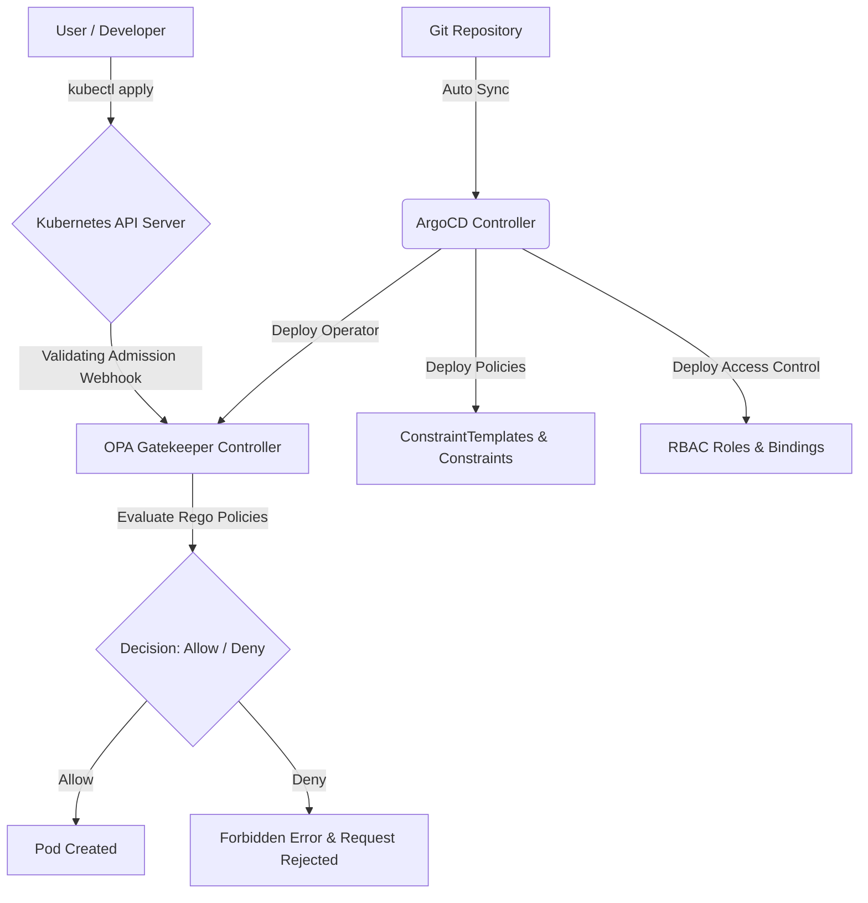

# KIẾN TRÚC BẢO MẬT KUBERNETES GITOPS: RBAC & OPA GATEKEEPER

Tài liệu này tổng hợp toàn bộ giải pháp thiết kế, triển khai, kiểm thử và xử lý sự cố cho hệ thống phân quyền **RBAC** và kiểm soát chính sách **OPA Gatekeeper** trong môi trường **Kubernetes (Minikube)**, được vận hành thông qua quy trình **GitOps (ArgoCD)**.

---

## 1. Tổng Quan Kiến Trúc GitOps Security

Hệ thống được thiết kế theo mô hình **Declarative Configuration (Cấu hình khai báo)**. Mọi tài nguyên bảo mật (Roles, RoleBindings, ConstraintTemplates, Constraints) được lưu trữ tập trung tại Git repository và tự động đồng bộ xuống Cluster thông qua **ArgoCD**.

### Mô hình luồng hoạt động:


---

## 2. Hệ Thống Phân Quyền RBAC (Role-Based Access Control)

Hệ thống RBAC đảm bảo nguyên tắc **Least Privilege (Đặc quyền tối thiểu)** cho các đối tượng nhân sự tham gia vận hành cluster:

### 2.1. Phân bổ vai trò (Roles & Bindings)
* **Developer (Alice):** Có toàn quyền quản lý tài nguyên ứng dụng (`deployments`, `pods`, `services`, `ingresses`, `rollouts`) trong namespace `demo`. Bị cấm truy cập các namespace khác và các tài nguyên quản trị cluster.
* **SRE (Bob):** Có quyền can thiệp sâu để debug hệ thống trên toàn cluster, bao gồm quản lý `nodes`, `persistentvolumes`, và xem logs.
* **Viewer (Carol):** Quyền chỉ đọc (`get`, `list`, `watch`) trên toàn bộ cluster để giám sát trạng thái.

### 2.2. Chi tiết cấu hình YAML mẫu

> [!IMPORTANT]
> Trong Kubernetes, resource `Role` và `ClusterRole` **không hỗ trợ thẻ `spec:`**. Các luật (`rules:`) phải được khai báo trực tiếp ở cấp độ cao nhất của manifest.

* **[rbac/roles.yaml](file:///d:/XBrain%20x%20AWS%20Accelerator%20Internship%20Program/PHASE%20-%20II/vanphutin-aws-accelerator-p2/cloud/w10/temp/rbac/roles.yaml):** Định nghĩa vai trò.
* **[rbac/rolebindings.yaml](file:///d:/XBrain%20x%20AWS%20Accelerator%20Internship%20Program/PHASE%20-%20II/vanphutin-aws-accelerator-p2/cloud/w10/temp/rbac/rolebindings.yaml):** Liên kết User với Vai trò tương ứng.

### 2.3. Lệnh kiểm thử quyền hạn (RBAC Verification)
Sử dụng cờ `--as` của `kubectl` để giả lập danh tính của user và kiểm tra quyền:
```powershell
# Kiểm tra xem Alice có thể tạo deployment trong namespace demo không (Kỳ vọng: yes)
kubectl auth can-i create deployment -n demo --as alice

# Kiểm tra xem Alice có thể tạo deployment trong namespace default không (Kỳ vọng: no)
kubectl auth can-i create deployment -n default --as alice

# Kiểm tra xem Bob có quyền xem danh sách Node không (Kỳ vọng: yes)
kubectl auth can-i get nodes --as bob

# Kiểm tra xem Carol có quyền xóa Pod không (Kỳ vọng: no)
kubectl auth can-i delete pod -n demo --as carol
```

---

## 3. Admission Control Với OPA Gatekeeper

OPA Gatekeeper chặn đứng các manifest không an toàn (vi phạm chính sách doanh nghiệp) ngay tại vòng tiếp nhận (Admission Webhook) của API Server.

### 3.1. Danh Sách 4 Chính Sách Bảo Mật Bắt Buộc

| # | Luật Enforce | Risk ID | Mô tả Chi tiết | File Cấu Hình |
|---|---|---|---|---|
| 1 | **Cấm image tag `:latest`** | F-01 | Tránh chạy các image không xác định rõ phiên bản trong production. | [k8s-no-latest-tag.yaml](file:///d:/XBrain%20x%20AWS%20Accelerator%20Internship%20Program/PHASE%20-%20II/vanphutin-aws-accelerator-p2/cloud/w10/temp/gatekeeper/constraints/k8s-no-latest-tag.yaml) |
| 2 | **Bắt buộc có `resources.limits`** | F-02 | Ngăn chặn Pod tiêu thụ cạn kiệt tài nguyên của Node (CPU/Memory starvation). | [k8s-require-resources.yaml](file:///d:/XBrain%20x%20AWS%20Accelerator%20Internship%20Program/PHASE%20-%20II/vanphutin-aws-accelerator-p2/cloud/w10/temp/gatekeeper/constraints/k8s-require-resources.yaml) |
| 3 | **Cấm `runAsUser: 0` (Chạy root)** | F-04 | Ngăn chặn container chạy dưới đặc quyền root để giảm thiểu rủi ro leo thang đặc quyền. | [k8s-no-root-user.yaml](file:///d:/XBrain%20x%20AWS%20Accelerator%20Internship%20Program/PHASE%20-%20II/vanphutin-aws-accelerator-p2/cloud/w10/temp/gatekeeper/constraints/k8s-no-root-user.yaml) |
| 4 | **Cấm `hostNetwork: true`** | — | Ngăn Pod truy cập trực tiếp vào network stack của host node, cô lập network bảo mật. | [k8s-no-host-network.yaml](file:///d:/XBrain%20x%20AWS%20Accelerator%20Internship%20Program/PHASE%20-%20II/vanphutin-aws-accelerator-p2/cloud/w10/temp/gatekeeper/constraints/k8s-no-host-network.yaml) |

---

### 3.2. Chính Sách Tự Viết (Custom Policy): Giới Hạn Số Lượng Replicas
* **Yêu cầu:** Chặn đứng bất kỳ Deployment nào khai báo số lượng replica vượt quá 5 (`replicas > 5`).
* **Định nghĩa Rego:**
  ```rego
  violation[{"msg": msg}] {
    replicas := input.review.object.spec.replicas
    max_replicas := input.parameters.maxReplicas
    replicas > max_replicas
    msg := sprintf("Deployment replicas '%v' exceeds maximum allowed limit of '%v'.", [replicas, max_replicas])
  }
  ```
* **Chi tiết cấu hình:** [k8s-max-replicas.yaml](file:///d:/XBrain%20x%20AWS%20Accelerator%20Internship%20Program/PHASE%20-%20II/vanphutin-aws-accelerator-p2/cloud/w10/temp/gatekeeper/constraints/k8s-max-replicas.yaml)

---

## 4. Giải Quyết Sự Cố Kỹ Thuật (Troubleshooting & Best Practices)

Trong quá trình thiết lập GitOps cho Gatekeeper, hai vấn đề kỹ thuật lớn đã được giải quyết triệt để:

### Vấn đề 1: Thứ tự triển khai (Dependency & Sync Waves)
* **Hiện tượng:** Khi deploy ứng dụng chứa cả `ConstraintTemplate` (định nghĩa CRD) và `Constraint` (sử dụng CRD), ArgoCD sẽ báo lỗi validation vì CRD chưa tồn tại trên cluster tại thời điểm bắt đầu sync.
* **Giải pháp:** Phối hợp sử dụng **ArgoCD Sync Waves** để phân lớp thời gian triển khai:
  1. **Gatekeeper Controller:** `sync-wave: "-2"` (Cài đặt operator và CRD lõi).
  2. **ConstraintTemplate:** `sync-wave: "1"` (Khởi tạo định nghĩa template).
  3. **Constraint:** `sync-wave: "2"` (Áp dụng chính sách dựa trên template đã tạo).
  4. **App quản lý constraints:** `sync-wave: "3"` (Deploy tổng thể).

### Vấn đề 2: Lỗi Validation Dry-Run của ArgoCD
* **Hiện tượng:** Trình quản lý ArgoCD thực hiện dry-run kiểm tra tính hợp lệ của toàn bộ manifest trước khi apply. Vì CRD được sinh ra động từ Template, bước dry-run của Constraint vẫn sẽ bị lỗi `"The Kubernetes API could not find constraints.gatekeeper.sh/..."`.
* **Giải pháp:** Cấu hình tuỳ chọn sync đặc biệt của ArgoCD trong [gatekeeper-constraints.yaml](file:///d:/XBrain%20x%20AWS%20Accelerator%20Internship%20Program/PHASE%20-%20II/vanphutin-aws-accelerator-p2/cloud/w10/temp/argocd/apps/gatekeeper-constraints.yaml):
  ```yaml
  syncPolicy:
    syncOptions:
    - ServerSideApply=true
    - SkipDryRunOnMissingResource=true
  ```
  `SkipDryRunOnMissingResource=true` bỏ qua bước xác thực dry-run đối với các tài nguyên chưa có CRD tại thời điểm bắt đầu, giúp luồng Sync Waves chạy trơn tru.

### Vấn đề 3: Bẫy Tự Chặn Ứng Dụng Hệ Thống (Self-Blocking API Rollout)
* **Lưu ý quan trọng:** Trước khi bật chế độ chặn (`deny`), ta cần kiểm tra xem chính ứng dụng API đang chạy của chúng ta (`api` Rollout) có vi phạm 4 luật trên không.
* **Kết quả đối chiếu:** 
  * Image: `ghcr.io/vanphutin/w10-api:0.0.1` -> Đã pin version cụ thể, không dùng `:latest` (Đạt).
  * Resources: Có khai báo limit CPU 200m và Memory 128Mi (Đạt).
  * Root/Network: Không sử dụng `runAsUser: 0` và không bật `hostNetwork: true` (Đạt).
  * Do đó, ứng dụng API chính của hệ thống hoàn toàn an toàn và hoạt động bình thường sau khi kích hoạt các chính sách Gatekeeper.

---

## 5. Quy Trình Kiểm Thử Và Nghiệm Thu (Verification Suite)

Thư mục [gatekeeper/tests/](file:///d:/XBrain%20x%20AWS%20Accelerator%20Internship%20Program/PHASE%20-%20II/vanphutin-aws-accelerator-p2/cloud/w10/temp/gatekeeper/tests) chứa toàn bộ các kịch bản test mẫu để nghiệm thu.

### 5.1. Bảng kịch bản kiểm thử

| Kịch bản | Lệnh kubectl | Kết quả kỳ vọng | Thông điệp lỗi thực tế |
|---|---|---|---|
| **Test 1: Image Latest** | `kubectl apply -f gatekeeper/tests/bad-latest-tag.yaml -n demo` | **REJECT (403)** | `... [no-latest-tag] Container 'web' is using the forbidden ':latest' tag.` |
| **Test 2: Thiếu resource limits** | `kubectl apply -f gatekeeper/tests/bad-no-limits.yaml -n demo` | **REJECT (403)** | `... [require-resources] Container 'web' does not have CPU and/or Memory limits defined.` |
| **Test 3: Chạy quyền Root (User 0)** | `kubectl apply -f gatekeeper/tests/bad-root-user.yaml -n demo` | **REJECT (403)** | `... [no-root-user] Pod securityContext runAsUser cannot be 0 (root).` |
| **Test 4: Host Network** | `kubectl apply -f gatekeeper/tests/bad-host-network.yaml -n demo` | **REJECT (403)** | `... [no-host-network] Using hostNetwork is forbidden.` |
| **Test 5: Replicas > 5** | `kubectl apply -f gatekeeper/tests/bad-deployment-replicas.yaml -n demo` | **REJECT (403)** | `... [max-replicas] Deployment replicas '6' exceeds maximum allowed limit of '5'.` |
| **Test 6: Pod hợp lệ** | `kubectl apply -f gatekeeper/tests/good-pod.yaml -n demo` | **PASS (200)** | `pod/test-good-pod created` |
| **Test 7: Deployment hợp lệ** | `kubectl apply -f gatekeeper/tests/good-deployment-replicas.yaml -n demo` | **PASS (200)** | `deployment.apps/test-good-replicas created` |

### 5.2. Lệnh dọn dẹp sau kiểm thử
```powershell
kubectl delete pod test-good-pod -n demo --ignore-not-found
kubectl delete deployment test-good-replicas -n demo --ignore-not-found
```

---

## 6. Kết luận & Khuyến nghị

Kiến trúc này thiết lập một hàng rào bảo mật vững chắc cho Kubernetes:
1. **RBAC** đảm bảo nhân viên chỉ có quyền trong phạm vi công việc.
2. **OPA Gatekeeper** đảm bảo không có bất kỳ cấu hình độc hại hoặc thiếu an toàn nào có thể lọt vào cluster, kể cả do vô tình hay cố ý.
3. **GitOps (ArgoCD)** tự động hóa quy trình phân phát chính sách này một cách đồng nhất và minh bạch từ mã nguồn Git.
