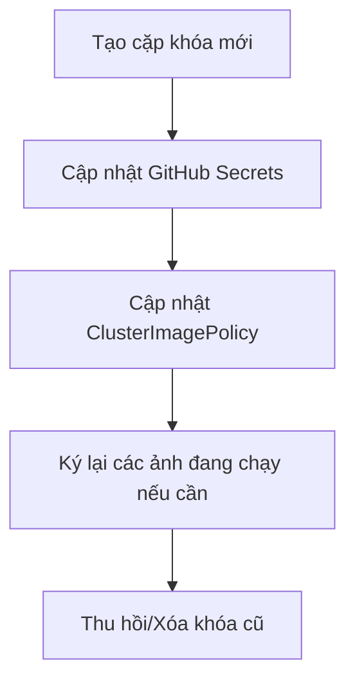

# Runbook: Cosign Key Pair Rotation

Tài liệu này hướng dẫn quy trình xoay vòng (rotation) cặp khóa ký số Cosign (`cosign.key` và `cosign.pub`) một cách an toàn mà không làm gián đoạn việc triển khai ứng dụng trong Kubernetes cluster.

---

## 1. Khi Nào Cần Xoay Vòng Khóa?
- Theo định kỳ bảo mật của doanh nghiệp (ví dụ: mỗi 6 tháng hoặc 1 năm).
- Khóa bí mật (`cosign.key`) hoặc mật khẩu giải mã khóa (`COSIGN_PASSWORD`) bị rò rỉ hoặc có nguy cơ bị lộ.
- Thay đổi nhân sự nắm giữ quyền quản trị khóa.

---

## 2. Quy Trình Các Bước Thực Hiện



### Bước 2.1: Tạo cặp khóa Cosign mới cục bộ
Chạy lệnh sau bằng Docker để tạo cặp khóa mới trong thư mục tạm:
```bash
docker run --rm -e COSIGN_PASSWORD="newsecurepassword2026" -v "${PWD}/signing_new:/keys" -w /keys ghcr.io/sigstore/cosign/cosign:v2.2.3 generate-key-pair
```
Sau lệnh này, bạn sẽ nhận được:
- File private key mới: `signing_new/cosign.key`
- File public key mới: `signing_new/cosign.pub`

---

### Bước 2.2: Cập nhật GitHub Secrets cho CI/CD Pipeline
Để các bản build tiếp theo tự động ký bằng khóa mới:
1. Truy cập Repo GitHub -> **Settings** -> **Secrets and variables** -> **Actions**.
2. Cập nhật giá trị hai secrets:
   - `COSIGN_PRIVATE_KEY`: Copy toàn bộ nội dung file `cosign.key` mới.
   - `COSIGN_PASSWORD`: Nhập mật khẩu mới (`newsecurepassword2026`).
3. Hoặc chạy lệnh CLI nếu có quyền:
   ```bash
   Get-Content -Path .\signing_new\cosign.key -Raw | gh secret set COSIGN_PRIVATE_KEY
   gh secret set COSIGN_PASSWORD --body "newsecurepassword2026"
   ```

---

### Bước 2.3: Cập nhật Public Key trong ClusterImagePolicy
Chúng ta cần cập nhật khóa công khai mới vào Kubernetes để hệ thống Admission Webhook chấp nhận các ảnh mới ký bằng khóa mới.

1. Đọc nội dung file `cosign.pub` mới.
2. Mở file `policies/cluster-image-policy.yaml` và thay thế nội dung khóa công khai cũ bằng khóa công khai mới tại mục `spec.authorities[0].key.data`.
3. Commit và push thay đổi lên Git:
   ```bash
   git add policies/cluster-image-policy.yaml signing/cosign.pub
   git commit -m "chore: rotate cosign public key in ClusterImagePolicy"
   git push
   ```
4. Đợi ArgoCD tự động đồng bộ hóa ứng dụng `policies`.

---

### Bước 2.4: Ký lại các ảnh phiên bản hiện tại (Re-signing existing images)
Do ảnh cũ được ký bằng khóa cũ, sau khi cập nhật `ClusterImagePolicy` với khóa mới, các Pod cũ nếu bị restart/re-create có thể bị reject nếu chính sách chỉ chứa khóa mới. 
Để tránh downtime, ta cần ký lại ảnh hiện tại bằng khóa mới:
```bash
# Thiết lập biến môi trường
$env:COSIGN_PASSWORD="newsecurepassword2026"
$private_key = Get-Content -Path .\signing_new\cosign.key -Raw

# Thực hiện ký lại ảnh đang chạy
docker run --rm -e COSIGN_PASSWORD=$env:COSIGN_PASSWORD -e COSIGN_PRIVATE_KEY="$private_key" ghcr.io/sigstore/cosign/cosign:v2.2.3 sign --key env://COSIGN_PRIVATE_KEY --yes ghcr.io/vanphutin/w10-api:v0.0.1
```

---

### Bước 2.5: Lưu trữ và thu hồi khóa cũ
- Di chuyển file `cosign.key` cũ vào bộ lưu trữ lạnh bảo mật (Vault hoặc offline backup) để đối chiếu lịch sử khi cần.
- Xóa hoàn toàn file `cosign.key` cũ khỏi môi trường local phát triển.
- Xác nhận kiểm thử chạy tốt trên cụm Kubernetes bằng cách deploy thử nghiệm ảnh được ký mới.
