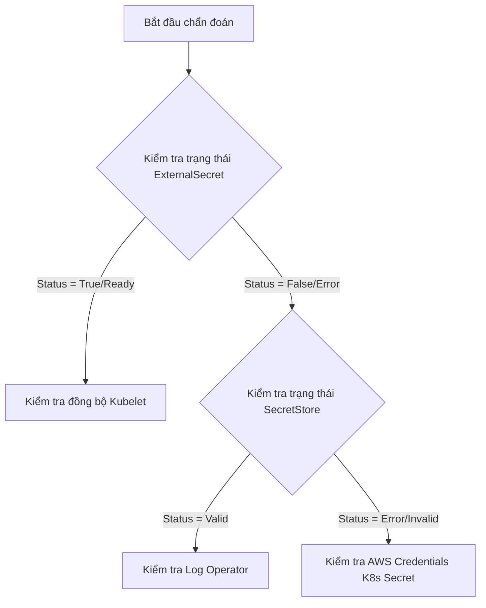

# Runbook: Troubleshooting External Secrets Operator (ESO) Sync Failures

Tài liệu này hướng dẫn kỹ sư SRE/DevOps cách chẩn đoán và khắc phục các sự cố liên quan đến việc đồng bộ hóa Secret từ AWS Secrets Manager vào Kubernetes bằng External Secrets Operator (ESO).

---

## 1. Triệu Chứng Sự Cố (Symptoms)
- Giá trị mật khẩu trong Pod hoặc Kubernetes Secret `api-db-secret` không cập nhật khi thay đổi trên AWS Secrets Manager.
- Khởi chạy API Pod báo lỗi `MountVolume.SetUp failed` do thiếu Secret `api-db-secret`.
- Trạng thái `ExternalSecret` hoặc `SecretStore` báo lỗi (Degraded / Error).

---

## 2. Quy Trình Chẩn Đoán (Diagnostics Workflow)



### Bước 2.1: Kiểm tra tài nguyên `ExternalSecret`
Chạy lệnh sau để kiểm tra trạng thái của `ExternalSecret`:
```bash
kubectl get externalsecret api-db-secret -n demo
```
- Nếu trạng thái là `SecretSynced` và `READY=True`: Cơ chế đồng bộ của ESO vẫn hoạt động tốt. Lỗi có thể nằm ở phía kubelet cache đồng bộ vào Pod chậm.
- Nếu trạng thái là `False` hoặc trống: Đọc mô tả chi tiết lỗi:
```bash
kubectl describe externalsecret api-db-secret -n demo
```

### Bước 2.2: Kiểm tra kết nối tới AWS (`SecretStore`)
Nếu `ExternalSecret` không thể lấy dữ liệu từ store, hãy kiểm tra trạng thái kết nối của `SecretStore`:
```bash
kubectl get secretstore aws-secretsmanager -n demo
```
- Nếu status khác `Valid` (hoặc `READY=False`), hãy chạy lệnh mô tả chi tiết:
```bash
kubectl describe secretstore aws-secretsmanager -n demo
```

### Bước 2.3: Kiểm tra thông tin xác thực AWS (`awssm-secret`)
Nếu `SecretStore` báo lỗi xác thực (`AccessDenied` hoặc `InvalidClientTokenId`), hãy kiểm tra xem Kubernetes Secret chứa AWS Access Key ID và Secret Access Key có tồn tại và đúng cấu hình không:
```bash
# 1. Kiểm tra sự tồn tại của secret
kubectl get secret awssm-secret -n demo

# 2. Đảm bảo chứa đúng các key `access-key` và `secret-access-key`
kubectl get secret awssm-secret -n demo -o jsonpath='{.data}'
```

### Bước 2.4: Kiểm tra log của ESO Controller
Nếu các tài nguyên trên bình thường nhưng việc đồng bộ không diễn ra, hãy xem log trực tiếp từ container điều khiển:
```bash
kubectl logs -n external-secrets -l app.kubernetes.io/instance=external-secrets-operator --tail=100
```

---

## 3. Các Giải Pháp Khắc Phục (Solutions)

### Sự cố 3.1: Lỗi xác thực AWS (Authentication / Permission Issues)
- **Nguyên nhân:** Khóa AWS Access Key bị thu hồi, hết hạn hoặc không có quyền đọc Secret `db-password`.
- **Khắc phục:**
  1. Tạo lại AWS Access Key hoạt động tốt.
  2. Cập nhật lại Kubernetes Secret:
     ```bash
     kubectl create secret generic awssm-secret -n demo \
       --from-literal=access-key="NEW_ACCESS_KEY" \
       --from-literal=secret-access-key="NEW_SECRET_KEY" \
       --dry-run=client -o yaml | kubectl apply -f -
     ```
  3. Khởi động lại Operator để xóa cache nếu cần:
     ```bash
     kubectl rollout restart deployment external-secrets-operator -n external-secrets
     ```

### Sự cố 3.2: Lỗi Webhook Validation (Connection Refused)
- **Nguyên nhân:** Webhook validation pod (`external-secrets-operator-webhook`) chưa sẵn sàng, dẫn đến việc tạo/sửa `SecretStore` bị từ chối.
- **Khắc phục:**
  1. Kiểm tra trạng thái webhook pod: `kubectl get pods -n external-secrets`
  2. Nếu pod bị treo ở `ContainerCreating`, kiểm tra lỗi ổ đĩa hoặc lỗi lấy image.
  3. Chờ pod chuyển sang trạng thái `1/1 Running` trước khi áp dụng lại manifest cấu hình.

### Sự cố 3.3: Muốn ép buộc đồng bộ hóa ngay lập tức (Force Resync)
Để bỏ qua chu kỳ `refreshInterval` 10 giây và bắt buộc ESO kéo giá trị mới ngay lập tức:
```bash
kubectl annotate externalsecret api-db-secret -n demo force-sync=$(date +%s) --overwrite
```
